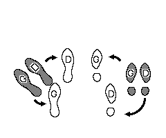
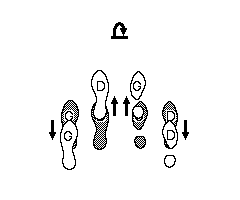

Avant-deux de Bazouges
======================

Если взять музыку из видео с танцем на фестивале, то она идёт на 4 счёта, которые идут парами. То есть каждые 8 счетов можно легко различить на слух. В музыке акцентом выделен 1й счет. Танец строится из элементов, каждый из которых выполняется за 4 счета. Но всегда два элемента удобнее считать одним элементом на 8 счетов - это позволит не выпадать из ритма.

В танце используется специальный шаг, который напоминает прихрамывание, его можно выучить, используя обучающее видео. Буду называть его базужным шагом далее. Замечу:
- в этом шаге есть опорная нога и не опорная. Опорная нога не меняется в течении всего танца.
- у кавалеров опорная нога - правая, а у дам - левая.
- можно заметить, что танцор почти никогда не наступает на пятку не опорной ноги.
- в базужном шаге спиной вперед НЕ опорная нога идёт первой, а опорная её догоняет.

Танец танцуется от двух пар и больше. Дама справа от кавалера, пары стоят по кругу, глядя в центр круга. Если пар две, то пары стоят друг напротив друга (на диаметре невидимого круга). Если пар три, то пары стоят на вершинах равностороннего треугольника, смотря в центр этого треугольника (треугольник можно вписать в круг). И т.д. Круг должен быть достаточно свободным, чтобы кавалер или дама могли сместиться от своего партнера вдоль круга. Некоторые замечания про случай только двух пар даны в конце описания.

Часть кавалеров
===============
Дамам нужно обязательно читать мужскую часть.

### Счёт 1-8:

- *смещение\_кавалера\_влево* 1-3:
- *прыжок\_в\_левую\_диагональ* 4
- *подпрыг* 5
- *возврат* 6-7
- *прыжок\_в\_правую\_диагональ* 8:

[на 1-3]: (*смещение\_кавалера\_влево*): кавалер на базужном шаге смещается от дамы влево вдоль круга, двигаясь задом (по часовой стрелке, не сильно далеко).

[на 4]: (*прыжок\_в\_левую\_диагональ*): прыгнуть на опорную ногу, толкаясь другой ногой. При этом нужно немного вынести её вперед - она зависает в воздухе. Прыгнуть нужно в левую диагональ (если смотреть в центр круга). На видео с танцем молодежи на фестивале направление хорошо видно.

[на 5]: (*подпрыг*): небольшой прыжок назад на опорной ноге (с одновременным легким задиранием второй ноги в колене).

[на 6 и 7]: (*возврат*): задом возвратиться базужным шагом к месту до прыжка. При этом НЕ опорная нога идёт первой, а опорная её догоняет.

[на 8]: (*прыжок\_в\_правую\_диагональ*): прыгнуть на опорную ногу, толкаясь другой ногой. Прыгнуть нужно в правую диагональ.

### Счет 9-16:

- *подпрыг* 1
- *возврат* 2-3
- *прыжок\_в\_левую\_диагональ* 4:
- *подпрыг* 5
- *возврат* 6-7
- *топ* 8

[на 4]: (*топ*): выставляем в бок опорную ногу не перенося на нее вес.

### Счет 17-24:

- *одиночный\_поворот* 1-3
- *прыжок\_в\_левую\_диагональ* 4
- *подпрыг* 5
- *возврат* 6-7
- *прыжок\_в\_правую\_диагональ* 8:

{И дамы, и кавалеры (в свою очередь) поворачиваются по часовой стрелке.}

[на 1-3]: (*одиночный\_поворот*): поворот вокруг своей оси на базужных шагах. Отмечу, что первый шаг поворота осуществляется толчком не опорной ноги - как и должно быть при базужном шаге.

### Счет 25-32:

- *подпрыг* 1
- *возврат* 2-3
- *прыжок\_в\_левую\_диагональ* 4
- *подпрыг* 5
- *возврат* 6-7
- *последний\_топ* 8

[на 8]: (*последний\_топ*): Прыгнуть поближе к своему партнёру так, чтобы опорная нога была впереди (опорная нога идёт вперед, не опорная - назад):  

### Счет 33-40:

- *поворот\_в\_паре* 1-3 
- *прыжок\_в\_паре* 4 
- *подпрыг\_в\_паре* 5 
- *возврат\_в\_паре* 6-7 
- *топ\_в\_паре* 8 
 
{как держаться}: дама справа от кавалера, держит его левой рукой за талию. Кавалер так же держит даму правой рукой за талию. Рука кавалера над рукой дамы. Кавалер с дамой стоят тесно, нога к ноге. Держатся крепко. Разворачиваются и двигаются вместе. 
 
[на 1-3]: (*поворот\_в\_паре*): на 1 кавалер размашисто прыгает на опорную ногу (перенося на нее вес, отталкиваясь другой ногой). Дама, соответственно, просто прыгает на опорную ногу (перенося на нее вес). На 2 прыгают и переносят вес на другую ногу, на 3 снова прыгают и переносят вес на опорную ногу. На 3 они все еще на начальном месте, только развернулись, вес на опорной ноге. 

[на 4]: (*прыжок\_в\_паре*): оба прыгают вперед на опорную ногу. При этом нужно немного вынести вторую ногу вперед - она зависает в воздухе. 

[на 5]: (*подпрыг\_в\_паре*): оба делают небольшой прыжок назад на опорной ноге. 

[на 6-7]: (*возврат\_в\_паре*): оба задом возвращаются базужным шагом к месту до прыжка. При этом НЕ опорная нога идёт первой, а опорная её догоняет. 

[на 8]: (*топ\_в\_паре*): Танцоры прыгают вверх одновременно на двух ногах и приземляются на обе ноги со смещением (опорная нога идёт вперед, не опорная - назад):  

 
### Счет 41-48: 

Повтор поворота в паре 
 
Часть дам
========= 
Начинаем счет заново. Замечу, что дамы сначала прыгают в правую диагональ, потом в левую, потом снова в правую - у кавалеров было наоборот. 
 
### Счёт 1-8:

- *смещение\_дамы\_вправо* 1-3 
- *прыжок\_в\_правую\_диагональ* 4 
- *подпрыг* 5 
- *возврат* 6-7 
- *прыжок\_в\_левую\_диагональ* 8: 
 
[на 1-3]: (*смещение\_дамы\_вправо*): дама на базужном шаге смещается от кавалера вправо вдоль круга, двигаясь задом (против часовой стрелки, не сильно далеко). 
 
### Счет 9-16: 

- *подпрыг* 1 
- *возврат* 2-3 
- *прыжок\_в\_правую\_диагональ* 4: 
- *подпрыг* 5 
- *возврат* 6-7 
- *топ* 8 
 
### Счет 17-24: 

- *одиночный\_поворот* 1-3 
- *прыжок\_в\_правую\_диагональ* 4 
- *подпрыг* 5 
- *возврат* 6-7 
- *прыжок\_в\_левую\_диагональ* 8: 
 
### Счет 25-32: 

- *подпрыг* 1 
- *возврат* 2-3 
- *прыжок\_в\_правую\_диагональ* 4 
- *подпрыг* 5 
- *возврат* 6-7 
- *топ* 8 
 
### Счет 33-40: 

- *поворот\_в\_паре* 1-3 
- *прыжок\_в\_паре* 4 
- *подпрыг\_в\_паре* 5 
- *возврат\_в\_паре* 6-7 
- *топ\_в\_паре* 8 
 
### Счет 41-48: 

Повтор поворота в паре 
 
Итого весь танец с циклом 96 счетов. 
 
Замечания
========= 
1. Смещения танцоров описаны для случая, когда много пар танцуют в круге. В случае же всего двух пар *смещение\_кавалера\_влево* и *смещение\_дамы\_вправо* осуществляется как указано на следующих картинках: 

2. В музыке отчетливо слышится первый, четвертый и восьмой счеты. Мнемоника: первая часть приходится всегда на начало смещения кавалера/дамы, на начало сольного или парного поворота, на подпрыг в РЕДКОЙ диагонали. 

Схемы с КАРТИНКАМИ, переведённые гуглопереводчиком:
===================================================
1. [раз](https://translate.google.ru/translate?sl=fr&tl=ru&js=y&prev=_t&hl=en&ie=UTF-8&u=http%3A%2F%2Fdansesbretonnes.gwalarn.org%2Fdanses%2Favant-deux_de_bazouges.html)
2. [два](https://translate.google.ru/translate?hl=en&sl=fr&tl=ru&u=http%3A%2F%2Fdansesbretonnes.gwalarn.org%2Fdanses%2Favant-deux_de_bazouges_pas_av2.html)
3. [три](https://translate.google.ru/translate?hl=en&sl=fr&tl=ru&u=http%3A%2F%2Fdansesbretonnes.gwalarn.org%2Fdanses%2Favant-deux_de_bazouges_pas_av4.html)
4. [четыре](https://translate.google.ru/translate?hl=en&sl=fr&tl=ru&u=http%3A%2F%2Fdansesbretonnes.gwalarn.org%2Fdanses%2Favant-deux_de_bazouges_av4.html)

Оригиналы на французском:

1. [раз](http://dansesbretonnes.gwalarn.org/danses/avant-deux_de_bazouges.html)
2. [два](http://dansesbretonnes.gwalarn.org/danses/avant-deux_de_bazouges_pas_av2.html)
3. [три](http://dansesbretonnes.gwalarn.org/danses/avant-deux_de_bazouges_pas_av4.html)
4. [четыре](http://dansesbretonnes.gwalarn.org/danses/avant-deux_de_bazouges_av4.html)

ВИДЕО:
======= 
1. видеоурок: [youtube.com/watch?v=i5ibFoxn8cE](https://youtube.com/watch?v=i5ibFoxn8cE)
2. пример танца на фестивале, танец в кругу: [youtube.com/watch?v=Ncds8-FMaEI](https://youtube.com/watch?v=Ncds8-FMaEI)
3. пример танца на соревнованиях, танец пара на пару: [youtube.com/watch?v=e12VDLG6tqo](https://youtube.com/watch?v=e12VDLG6tqo)

МУЗЫКА:
========
- Les Danses Bretonnes – Avant-deux de Bazouges (par Hanter-Vro) fest noz de Ploeren 01-12-2012    5:25 [youtube.com/watch?v=Ncds8-FMaEI](https://www.youtube.com/watch?v=Ncds8-FMaEI)
- Kendirvi – Allez, viens! (Avant deux de Bazouges) 5:23
- Hamon Martin Quintet – De Bazouges à la Hollande 3:48
