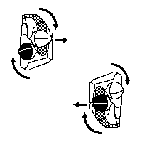
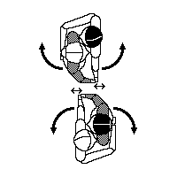
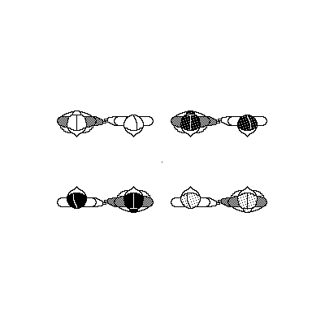
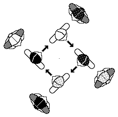

Avant-quatre du Tregor (Avant-deux du Tregor)
=============================================
# Аван-кятр дю Трегор (Аван-дё дю Трегор)

## Основной шаг

[Автоматический перевод схемы (с картинками)](https://translate.google.ru/translate?hl=en&sl=fr&tl=ru&u=http%3A%2F%2Fdansesbretonnes.gwalarn.org%2Fbases%2Fpas_de_quatre_subdivise_avg.html&sandbox=1). [_Оригинал на французском_](http://dansesbretonnes.gwalarn.org/bases/pas_de_quatre_subdivise_avg.html).

Этот шаг используется весь танец. Музыка идет на счёт 1-и-2-3-4. Этому соответствуют шаги (вес всегда переносится полностью):

**[на 1-и-2]**: шаг вперёд левой на полторы ступни (вес был на правой), шаг вперед правой чтобы почти вровень с левой (вес был на левой), шаг вперед левой на расстояние ступни (вес был на правой),  
**[на 3]**: шаг вперед правой чтобы вровень с левой (вес был на левой),  
**[на 4]**: сейчас вес на правой, а левая нога отрывается зависает в районе правой лодыжки.

Это был шаг вперед. Шаг назад происходит тоже с левой ноги, на те же счёты, только назад.

## Avant-deux du Tregor

Танец для двух пар. [Автоматический перевод схемы (с картинками)](https://translate.google.ru/translate?hl=en&sl=fr&tl=ru&u=http%3A%2F%2Fdansesbretonnes.gwalarn.org%2Fdanses%2Favant-deux_du_tregor.html&sandbox=1). [_Оригинал на французском_](http://dansesbretonnes.gwalarn.org/danses/avant-deux_du_tregor.html).

Первые 16 счётов: две пары стоят друг на против друг друга. Держатся за руки, руки опущены.

**[на 1-4]**: обе пары, держась за руки, на основном шаге сходятся. При этом руки раскачиваются от состояния "согнуты в локте на 90 градусов" до "опущены вниз". 4 счёта - 4 раскачивания, на чётные счеты руки опущены вниз.  
**[на 5-8]**: тоже самое, что в [на 1-4], только пары расходятся. Тут, кстати, можно на 8 слегка развернуться в сторону своего партнера и посмотреть на него (как на втором видео, на котором шаги видно, делают некоторые кавалеры).
**[на 9-12 и 13-16]**: пары снова сходятся и расходятся как в [на 1-4] и [на 5-8]. На 16 - отпускают руки.

Вторые 16 счётов:

**[на 1-и-2 дама]**: Кладет свою левую руку себе на талию, ладошкой наружу. Кладёт в то место, куда обычно кладет руку кавалер в парных танцах (смотрите видео). Правую же руку отводит в сторону и сгибает под углом 90 градусов (плечо параллельно полу, предплечье - почти перпендикулярно). Этой рукой она ждёт-встречает руку кавалера, который не заставит себя долго ждать. И да, на эти счёты 1-и-2 она еще делает на месте шаг-шаг-шаг, чтобы не выпасть из ритма основного шага.  
**[на 1-и-2 кавалер]**: На первой половине основного шага на необходимо длинных шагах добирается до дамы, которая стоит напротив него стоит в позе, напоминающей чайник.  
**[на 3, 4 кавалер]**: Левой рукой хватает носик чайника, а правой - ручку. Ручка расположена там, где кавалеру привычно - на талии. Начиная крутиться по часовой стрелке в паре, доделывает вторую половину основного шага. Пусть это будет поворот примерно на четверть круга.  
**[на 3, 4 дама]**: Замечает схватившего её кавалера, хотя, конечно, лучше бы встречать кавалера взглядом ещё на подходе. Доделывает вторую половину основного шага, вращаясь с кавалером.  
**[на 5-8]**: Пара вращается на основном шаге на пол-оборота (по часовой).  
**[на 9-12]**: Пара вращается на основном шаге на пол-оборота (по часовой).  
**[на 13-16]**: Пара вращается на основном шаге на пол-оборота (по часовой). При этом кавалер дополнительно продвигает пару в сторону другой пары (это делают оба кавалера). Таким образом пары сближаются:  
  
**[на 16]**: Кавалер отпускает левой рукой правую руку дамы (отпускает носик чайника) и пара раскрывается так, чтобы лицом оказаться к другой паре:  
   
Таким образом, у нас снова есть две пары, смотрящие друг на друга, только они махнулись партнёрами.

Далее всё повтояется. На правах шутки: это довольно однообразно так танцевать, поэтому танец можно разнообразить вариацией "бегущий чайник". В ней через раз бежит не кавалер, а дама. Бежит прямо в позе чайника - так веселее.

## Avant-quatre du Tregor

Танец для четырёх пар. Является расширением Avant-deux du Tregor (ну или наоборот: Avant-deux du Tregor - лишь часть). [Автоматический перевод схемы (с картинками)](https://translate.google.ru/translate?sl=fr&tl=ru&js=y&prev=_t&hl=en&ie=UTF-8&u=http%3A%2F%2Fdansesbretonnes.gwalarn.org%2Fdanses%2Favant-quatre_du_tregor.html&edit-text=). [_Оригинал на французском_](http://dansesbretonnes.gwalarn.org/danses/avant-quatre_du_tregor.html).

Танец состоит из повторений выше описанного Avant-deux du Tregor много раз. Пусть две пары стоят напротив двух других пар:  
  
Пары за 32 счёта танцуют описанный выше Avant-deux du Tregor с парой, которая напротив них. Отличие лишь в том, что кавалер выходит из вращения так, чтобы оказаться лицом к новой даме, а не к той, с которой он за ручку ходил взад-вперед (то есть вся пара разворачивается в этом направлении). И так эти 32 счёта повторяются до тех пор, пока кавалер не вернётся к своей даме (32х4=128). После этого пары поворачиваются лицом к парам, которые по диагонали от них, и танцуют Avant-deux du Tregor с ними. Только в этот раз кавалеры разворачиваются к своей даме и танцуют последний Avant-deux du Tregor уже с ней. Что символично. Чтобы кавалеры не врезались друг в друга на диагональных частях, нужно, чтобы никто не зевал, тогда можно успеть сделать так:  
  
Итого: 32х6=192 - можно устать!

## Avant-trois du Tregor

Если пар всего три, и всем очень хочется потанцевать, то можно модифицировать танец следующим образом:

Пары стоят в вершинах равностороннего треугольника, вписанного в круг (просто стоят по кругу равномерно), туловище "смотрит" в центр круга. На первые 16 счётов пары ходят в центр круга, и из центра круга. Смена же партнёров на вторые 16 счётов происходит по кругу против часовой стрелки (или по :D). И так 6 раз (32х6) и кавалер в итоге возвращается снова к своей даме. 

Video:
======
- Хорошо передаёт атмосферу: [youtu.be/H5DNoZ2F3jw](https://www.youtube.com/watch?v=H5DNoZ2F3jw)
- Видно шаги: [youtu.be/_f1SuYq47kM](https://www.youtube.com/watch?v=_f1SuYq47kM)

Music:
=======
Apprenez Les Danses Bretonnes vol.1 – En avant quatre du Tregor 2:51
