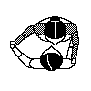
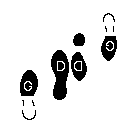
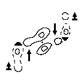
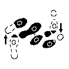
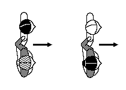

# Cercle Circassien
### (Сёркль Сиркасьён, Черкесский круг)

Пары кавалер + дама (дама справа от кавалера) становятся в один большой круг, держась мизинцами.

По ссылкам - схемы с КАРТИНКАМИ, переведённые гуглопереводчиком.

- [Сёркль Сиркасьён](https://translate.google.ru/translate?sl=auto&tl=ru&js=y&prev=_t&hl=en&ie=UTF-8&u=http%3A%2F%2Fdansesbretonnes.gwalarn.org%2Fdanses%2Fcercle_circassien.html&edit-text=)
- **[на 1-4]:** [двойной, вперед с левой ноги, поднятый](https://translate.google.ru/translate?hl=en&sl=fr&tl=ru&u=http%3A%2F%2Fdansesbretonnes.gwalarn.org%2Fbases%2Fdouble_avant_gauche_pied_leve.html)  
  На счёт 1-2-3-4 шагают вперед левой-правой-левой-мах-правой. Мах правой - это когда вес на всей левой ноге, а правая нога поднимается на уровень лодыжки. При этом руками машут вверх-вниз так, что на 1 и на 3: руки согнуты в локте под тупым углом и почти не вытянуты вперед (плечевая кость ориентирована вертикально), на 2 и на 4: руки опущены вниз, почти не согнуты в локте, даже чуть-чуть торчат из-за спины.
- **[на 5-8]:** [двойной, назад с правой ноги, поднятый](https://translate.google.ru/translate?hl=en&sl=fr&tl=ru&u=http%3A%2F%2Fdansesbretonnes.gwalarn.org%2Fbases%2Fdouble_arriere_droit_pied_leve.html)  
  На счёт 1-2-3-4 шагают назад правой-левой-правой-мах-левой (руки - так же как в **[на 1-4]**).
- **[на 9-12]:** тоже самое, что и **[на 1-4]**.
- **[на 13-16]:** тоже самое, что и **[на 5-8]**.
- **[на 17-24]:** Все расцепляют руки, дамы идут вперед с левой ноги как в **[на 1-4]**, потом возвращаются на свое место как в **[на 5-8]**, при этом не забывают также махать руками. Кавалеры в это время хлопают в ладоши в такт музыке.
- **[на 25-28]:** Кавалеры идут вперед с левой ноги как в **[на 1-4]** (также машут руками), но на счёт 4 делают не просто хоп, а хоп с разворотом на 180 градусов. Дамы в это время хлопают в ладоши в такт музыке.
- **[на 29-32]:** [двойной, вперед с правой ноги, поднятый](https://translate.google.ru/translate?hl=en&sl=fr&tl=ru&u=http%3A%2F%2Fdansesbretonnes.gwalarn.org%2Fbases%2Fdouble_avant_droit_pied_leve.html)  
  Кавалеры идут вперед к даме, которая справа (когда стояли в кругу, она была слева от кавалера). На счёт 1-2-3-4 шагают вперед правой-левой-правой-мах-левой. Руками, наверно, можно не махать, ибо легко сбиться после разворота.
- **[на 33-48]:** [шаг Patinette](https://translate.google.ru/translate?hl=en&sl=fr&tl=ru&u=http%3A%2F%2Fdansesbretonnes.gwalarn.org%2Fbases%2Fpas_de_patinette.html)  
  Кавалер берет даму: правая рука кавалера на талии дамы, левая рука кавалера держит правую руку дамы на расстоянии от туловища, дама кладёт левую руку на правое плечо кавалера. За 16 счётов происходит вращение. Как происходит вращение смотрите по [ссылке](https://translate.google.ru/translate?hl=en&sl=fr&tl=ru&u=http%3A%2F%2Fdansesbretonnes.gwalarn.org%2Fbases%2Fpas_de_patinette.html), или угадайте по картинкам (чёрным показано где находится вес тела):

**[исходное положение]:**  
   
**[на 1]:**  
  
**[на 2]:**  

- Из вращения надо выйти так, чтобы кавалер и дама оба смотрели вдоль круга против часовой стрелки. То есть, кавалер своей левой рукой отпускает правую руку дамы и становится справа от нее:

- **[на 49-62]:** [полечный шаг на два с левой ноги](https://translate.google.ru/translate?hl=en&sl=fr&tl=ru&u=http%3A%2F%2Fdansesbretonnes.gwalarn.org%2Fbases%2Fpas_de_polka_avant_gauche.html) и [полечный шаг на два с правой ноги](https://translate.google.ru/translate?hl=en&sl=fr&tl=ru&u=http%3A%2F%2Fdansesbretonnes.gwalarn.org%2Fbases%2Fpas_de_polka_avant_droit.html)  
  14 счётов пара на полечных шагах движется по кругу против часовой стрелки. Полечный шаг идёт на счёт 1-и-2, 3-и-4. Где трёхшаг в 1-и-2 - с левой ноги (левой-правой-левой), а трёхшаг в 3-и-4 - с правой ноги (правой-левой-правой). Причём вес на все разы переносится полностью. Перемещения же идут при этом вперед-приставить-вперед. На 14 счёт кавалер останавливается (он должен был доделать трехшаг с левой ноги и может теперь шагать с правой). 
- **[на 63-64]:** За 2 счёта пара делает четверть оборота влево чтобы смотреть в центр круга: оба делают полечный шаг в повороте. И кавалеры, и дамы хватают мизинцами соседей.

_// Автор описания - Пётр Загубисало. В описании использованы картинки с сайта [dansesbretonnes.gwalarn.org](http://dansesbretonnes.gwalarn.org). //_

Оригиналы на французском:

- [Cercle Circassien](http://dansesbretonnes.gwalarn.org/danses/cercle_circassien.html)
- [double avant gauche pied levé](http://dansesbretonnes.gwalarn.org/bases/double_avant_gauche_pied_leve.html)
- [double arrière droit pied levé](http://dansesbretonnes.gwalarn.org/bases/double_arriere_droit_pied_leve.html)
- [double avant droit pied levé](http://dansesbretonnes.gwalarn.org/bases/double_avant_droit_pied_leve.html)
- [pas de Patinette](http://dansesbretonnes.gwalarn.org/bases/pas_de_patinette.html)
- [pas de Polka avant du pied gauche](http://dansesbretonnes.gwalarn.org/bases/pas_de_polka_avant_gauche.html)
- [pas de Polka avant du pied droit](http://dansesbretonnes.gwalarn.org/bases/pas_de_polka_avant_droit.html)

ВИДЕО:
======
[youtube.com/watch?v=JUIEfPi_SgY](https://www.youtube.com/watch?v=JUIEfPi_SgY)
МУЗЫКА:
=======
- Duo TTC – Cercle circassien - Bal à Lyon 4:30 [youtube.com/watch?v=AJ29pfX7p8s](https://www.youtube.com/watch?v=AJ29pfX7p8s)
- Diwall – Pull To Stop The Engine (Cercle Circassien) 4:18
