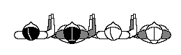

Hanter dro
==========
# Антердро

### Первое описание:

Танцуется на три счета. Все встают в круг или цепочку. Желательно по возможности встать так, чтобы чередовались дамы и кавалеры. Соседние люди в кругу берутся за руки так, как показано на видео и на прикрепленной картинке:  

Музыка идёт на счёт 1-и-2-3, ей соответствуют шаги: шаг-приставить-шаг-шаг.

[1]: изначально вес тела на правой ноге. Шаг левой ногой вдоль земли на пятнадцать сантиметров влево и слегка вперед.  
[И]: изначально вес тела на левой ноге. Шаг правой ногой: она поднимается и приземляется рядом с левой ногой, но немного позади от неё.  
[2]: изначально вес тела на правой ноге. Шаг левой ногой: она идет вдоль земли на десять сантиметров влево и слегка вперед.   
Изначально вес тела на левой ноге. Правая нога поднимается и задерживается в воздухе на высоте левой лодыжки (немного позади).  
[3]: изначально вес тела на левой ноге. Шаг правой ногой: она идёт вдоль земли на двадцать сантиметров назад.  
Изначально вес тела на правой ноге. Левая нога поднимается и задерживается на высоте правой лодыжки (немного впереди).

### Подробная схема на русском (хороший автоматический перевод) С КАРТИНКАМИ:
[Перевод](https://translate.google.ru/translate?hl=en&sl=auto&tl=ru&u=http%3A%2F%2Fdansesbretonnes.gwalarn.org%2Fdanses%2Fhanter-dro.html). [Оригинал на французском](http://dansesbretonnes.gwalarn.org/danses/hanter-dro.html)

_// Описание перевел - Пётр Загубисало. //_

### Второе описание:

_// Тут счеты идут в два раза чаще: 1-2-3-4-5-6 это на самом деле 1-и-2-3. //_

В Бретани только гавот (gavotte) и паспи (passepied)- свои исконные разновидности танцев, а вот андро и антердро - это древнейшие из заимствованных танцев и сохранившихся до наших дней. В противоположность андро, антердро - это бретонская локализация ренессансных branles simples.
Главное отличие их в том, что андро - восьмибитный танец, а антердро - шестибитный, что добавляет разнообразия бретонским танцам. Собственно из-за этой особенности он и получил своё название "hanterdans" - "полутанец", что уже позже превратилось в "hanter-dro".
Уже в 19 веке, на основе антердро оформилась важнейшая разновидность танцев - ридэ и ларидэ. Собственно, ридэ на 6 счётов - это не что иное, как антердро с активными руками под более быстрый темп. Разница в названиях "ридэ" и "ларидэ" появилась по тем же причинам, что и между названиями "тур" и "андро". Изначально, эта разновидность танцев формировалась в бретоноязычных областях Ванна и называлась ridee. Когда эти танцы стали проникать в романоязычную Верхнюю Бретань (Haute-Bretagne), там их просто называли 'la ridee', что со временем стало просто "laride".

Танец длиной в 6 счётов, танцуется в кольце или цепочке. 

Руки исходно в гавотной позиции, то есть на уровне груди, при этом, левая рука отведена влево - по ходу движения и находится в правой руке соседа слева, а своей правой рукой сжимаем левую руку соседа справа. Если руки задрать повыше - это будет корнуайская модификация гавотной позиции рук, так как там немало сложных, активных, гавотов, в которых надо покрепче держаться друг за дружку. А ваннский вариант гавотного хвата порасслабленнее - руки слегка опущены, ведь эта модификация родом прямиком из антердро - медитативного, расслабленного. 

Стилистически танец, как и андро, тоже расслабленный и отдыхательный. 

**Ноги**  
Снова начинаем с левой ноги влево.  
На счёты 1-2-3 выполняем тройной переступ левой-правой-левой ногами, шагаем на каждый счёт. Это уже не привычный тройной переступ за 2 счёта, а за 3. _[В ускоренной версии это 1-и-2]_.  
На счёты 4-5 - пауза с весом на левой ноге, при этом никуда не двигаемся. _[В ускоренной версии это время между 2 и 3]_.  
На счёт 6 переносим вес на правую ногу, при этом освобождая левую для нового начала. _[В ускоренной версии это 3. В итоге весь ритм: 1-и-2-3 (счёты идут, разумеется, равномерно)]_.  

**Руки**  
Тут всё скучно - просто держим их в гавотной позиции весь танец, можно слегка их покачивать вперёд - назад в ритм музыке.

_// Это описание из группы "Бретонские народные танцы в Москве", автор - Алексей Пырников: [vk.com/topic-25749886_28982641](https://vk.com/topic-25749886_28982641), [vk.com/topic-25749886_28982651](https://vk.com/topic-25749886_28982651). Комментарии - Пётр Загубисало. //_

Video:
======
- [youtu.be/zIrcXwWvpj0](https://www.youtube.com/watch?v=zIrcXwWvpj0)

Music:
=======
- Kendirvi – Ar Kilim (Hanter dro) 5:28
- Skolvan - Tadin-Tinaketa (Hanter dro) 4:39
- Stelenko - La fille de rose (hanter dro) 5:18
- Talar - 7 aout 1845 (Hanter dro) 5:33
- Tri Yann – Hanter-Dro Macabre 4:47
