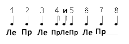

Kost ar c'hoat
==============
# Костархот (Кастарват)
Очень популярный гавот на 4,5 из одноимённой традиционной области (pays traditionnel) в Корнуае (Cornouaille). Танцуется, как минимум, на каждом втором фест-нозе (fest-noz).

По-бретонски произносится примерно как [костархот], а у нас известен как костарват.

Это, пожалуй, танец - чемпион по количеству вариаций, от отдыхательных до полуакробатических.

Ну а сейчас базовый вариант.

По длине ничего нового - одна восьмёрка.

Исходно стоим в кольце или цепочке. Руками держимся по-гавотному, то есть руки на уровне груди, правая согнута в локте и держит вложенную в неё руку человека справа, а левая рука вытянута и лежит в правой руке человека слева. Вот и все руки в этом танце.

Начиная с левой ноги, на счёты 1-2-3 идём влево левой-правой-левой ногами на каждый счёт.
На счёты 4-5 тройной переступ правой-левой-правой ногами, по итогам которого, вес оказывается на правой ноге.
На счёт 6 выдёргиваем из-под себя правую ногу (для чего нужно приложить усилие, так как она под весом), слегка вынося её вперёд, одновременно переносим вес на левую ногу. 
На счёт 7 проделываем всё тоже самое, что и на счёт 6, но теперь с левой ногой, в итоге - вес на правой ноге.
На счёт 8 - пауза с весом на правой ноге, при этом левой ногой совершаем небольшой замах право перед правой ногой.

Стилистически, данная вариация активная и бодрая, как и все костарваты, но за счёт чётких и слегка резковатых движений, а не прыжков или скачек - то есть далеко бежать и высоко прыгать в данной вариации не надо. 

Главная задача, которая наверняка возникнет поначалу - не сбиться на привычный ритм гавота 3,4. Просто надо некоторое время держать в голове необходимость делать тройной переступ на счёты 4-5.

_// Это описание из группы "Бретонские народные танцы в Москве", автор - Алексей Пырников: [vk.com/topic-25749886_27769649](https://vk.com/topic-25749886_27769649). //_

Счёты и ноги:  

Music:
=======
- Loened fall – Kost ar c'hoat 4:46
- Mervent – Kost Ar C'hoat 3:49 [youtu.be/EAVpaW_7qlQ](https://www.youtube.com/watch?v=EAVpaW_7qlQ)
- Reelroad – Венгерская 4:29

Video:
======
Для введения в атмосферу, ибо вариация танца на видео несколько другая:
- [youtu.be/EAVpaW_7qlQ](https://www.youtube.com/watch?v=EAVpaW_7qlQ)
- [youtu.be/P-HmNaDJCgs](https://www.youtube.com/watch?v=P-HmNaDJCgs)
