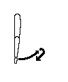
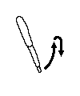
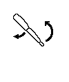

Rond de Saint-Vincent sur Oust
==============================
Круг Cвятого Винсента
---------------------

Танец крайне простой: на 4 счёта - 4 взмаха руками, 4 шага. Шаги:
* начинаем - ноги вместе
* **1**: левой влево-вперёд
* **2**: превую поставить впереди справа от левой (недалеко вправо, на одну ступню вперед)
* **3**: левой влево
* **4**: правую поставить сзади справа от левой (недалеко вправо, на одну ступню назад)
* **следующий 1**: левой влево

При этом руки:

* начинаем - руки опущены
* **1**: Руки вытянуты. Они поднимаются до сорока градусов и немного опускаются:  
  
* **2**: Руки вытянуты. Они поднимаются до шестидесяти градусов и немного опускаются:  
  
* **3**: На 3-4 руки, похоже, делают "помпу". На 3 плечо становится вертикально (идёт назад), а локти сгибаются (идут вверх):  
  
* **4**: Руки выдвигаются вперед, описывают большую дугу и возвращаются вниз, повиснув вдоль тела (немного позади):  
  

Легко понятное описание есть [здесь](https://translate.google.ru/translate?sl=fr&tl=ru&js=y&prev=_t&hl=en&ie=UTF-8&u=http%3A%2F%2Fdansesbretonnes.gwalarn.org%2Fdanses%2Frond_de_saint-vincent_sur_oust.html&edit-text=).

Video
=====
* [youtu.be/6iXaMQ8uuM4](https://www.youtube.com/watch?v=6iXaMQ8uuM4)

Music
=====
* Talar - Ti Ken` (Ronds De St-Vincent) 4:33
* Accordzéâm - Englishman In St Vincent (Rond de Saint-Vincent) 6:12

